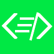

<p align="center">
    
</p>

<p align="center">
  My first  <a href="https://brittanychiang.com" target="_blank">portfilio</a>, which I created with <a href="https://nextjs.org/" target="_blank">Nextjs</a> and hosted on <a href="https://vercel.com/" target="_blank">Vercel</a>
</p>
<hr/>

## Built with

<li>Reactjs</li>
<li>Nextjs</li>
<li>Styled Components</li>
<li>Emailjs</li>
<li>Sweetalert2</li>

## Preview


## Installation & set-up

1. Clone this repo

```sh
git clone https://github.com/cedgarcia/portfolio.git
```

2. Install dependencies

```sh
yarn install
```

3. Start the development server

```sh
yarn run dev
```
